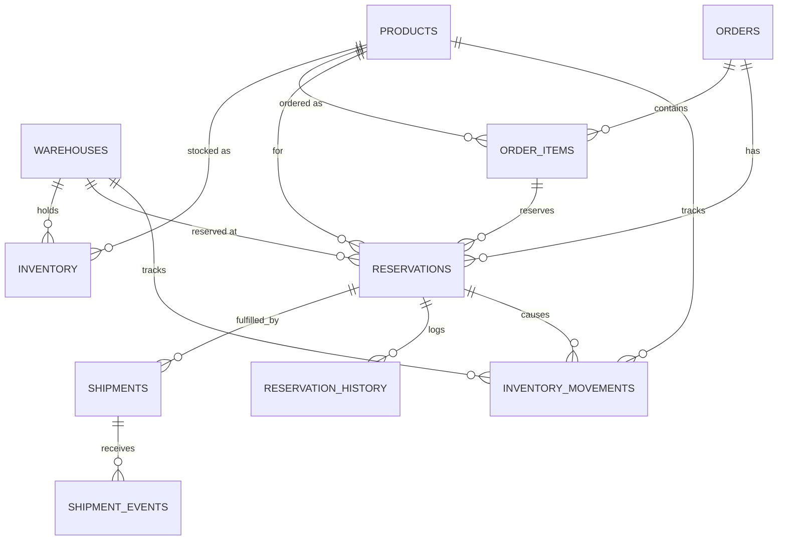

# Architecture

## Domain model

The brief names 8 core entities. Two were implemented as two tables each:

- **Orders** normalizes into `orders` + `order_items` (an order holds multiple line items — standard relational normalization).
- **Shipment records** splits into `shipments` (current state) + `shipment_events` (append-only idempotency/audit ledger) — this isn't normalization, it's a deliberate addition to satisfy the "handle duplicate webhook callbacks safely" requirement.

`inventory_movements` and `reservation_history` are both intentionally append-only audit logs, not normalized structures — they exist to answer "what happened and when," separate from current-state tables.

## Why not deduct inventory at order placement?

Placing an order and physically fulfilling it are different moments in time — payment can fail, warehouses can be wrong about stock, shipments can fail. Deducting inventory immediately would conflate "customer wants this" with "customer has this." Instead, inventory moves through explicit stages (`available → reserved → shipped`), and only shipment confirmation represents inventory actually leaving the warehouse.

## Business rule decisions

The brief intentionally leaves five business rules open. Decisions made, with reasoning:

1. **Can reservations expire?** Yes — a 15-minute TTL by default, swept via `ReservationService::releaseExpired()`. Rationale: prevents abandoned reservations from permanently locking stock, without requiring a complex background-worker architecture beyond a periodic sweep.

2. **How do partial shipments affect reservations?** The reservation stays open (`partially_shipped` status) until the full reserved quantity ships or the remainder is explicitly cancelled. Rationale: this honors the original commitment to the customer rather than silently releasing stock they were promised — matches common real-world ERP/WMS behavior.

3. **Can inventory be transferred while reserved?** No — transfers may only draw from `available_quantity`, never `reserved_quantity`. Rationale: a reservation is a commitment to a specific customer; the underlying physical stock shouldn't move until that commitment is fulfilled or explicitly released.

4. **Should reservations lock inventory immediately?** Yes, at the moment `reserve()` is called (not at payment confirmation). Rationale: this is the simplest design that fully prevents overselling; the trade-off (stock could be held by abandoned carts) is mitigated by the TTL/expiry mechanism above.

5. **How is overselling prevented?** Pessimistic locking via `lockForUpdate()` inside a DB transaction on the specific `inventory` row being mutated. Rationale: guarantees correctness under concurrent access with a simple, easy-to-reason-about mechanism, at the cost of some contention under very high load on a single SKU/warehouse pair — an acceptable trade-off given the challenge's scale.

## Concurrency handling

Every stock-mutating operation (`reserve`, `release`, `confirmShipment`) wraps its logic in `DB::transaction()` and acquires a row lock via `lockForUpdate()` on the specific `inventory` row (matched by `product_id` + `warehouse_id`) before reading or writing quantities. This serializes concurrent requests for the same product/warehouse pair — if two requests race for the last unit, the second transaction blocks until the first commits, then re-reads the now-updated row and correctly fails with `InsufficientStockException` if stock is exhausted.

This was verified with an automated test (`concurrent_reservations_for_the_last_unit_only_one_succeeds`) simulating two sequential attempts against depleted stock, and manually via separate terminal sessions issuing near-simultaneous requests.

## Idempotency

Duplicate shipment webhook callbacks are guarded by a unique `idempotency_key` on `shipment_events`. Before processing any shipment outcome, the job checks whether an event with that key already exists; if so, it's a safe no-op. This was verified in `duplicate_shipment_job_run_does_not_double_ship`.

## Failure resilience

`ProcessShipmentJob` is queued (Redis-backed) with `tries = 3` and a 10-second backoff. Every mutation happens inside a DB transaction, so a mid-job crash never leaves inventory in a partially-updated state — either the whole operation commits or none of it does, making retries safe.

## Security considerations

- All database access goes through Eloquent/query builder — no raw SQL string concatenation anywhere, eliminating SQL injection risk.
- Every model uses explicit `$fillable` allow-lists rather than `$guarded = []`, preventing unintended mass assignment.
- Quantity inputs are validated (`> 0`) at the service layer before any mutation is attempted.
- No HTTP/API surface exists in this phase, which minimizes the attack surface; if an API were added, the service layer (not controllers) already contains all validation and locking logic, so a thin controller could be added with minimal additional risk.

## Trade-offs and future improvements

- **SRP note**: `ReservationService` handles both business logic and audit logging (`logMovement`/`logHistory`). This was a deliberate choice — every operation's audit trail is a mandatory side effect of the domain rule, not an optional cross-cutting concern. If a second service (e.g. a future `TransferService`) needed the same logging, I'd extract an `InventoryAuditLogger` to avoid duplication.
- **Scaling**: under very high contention on a single SKU/warehouse, pessimistic locking could become a bottleneck. An optimistic-locking (`version` column) alternative would trade simplicity for better throughput, at the cost of needing retry logic in calling code.
- **Reservation expiry** currently requires an external trigger (cron calling the Artisan command) rather than being self-scheduling — acceptable for this scope, but would need Laravel's scheduler wired to a real cron entry in production.
- Not implemented, out of scope for this challenge: HTTP API, authentication, UI, multi-region inventory sync.
